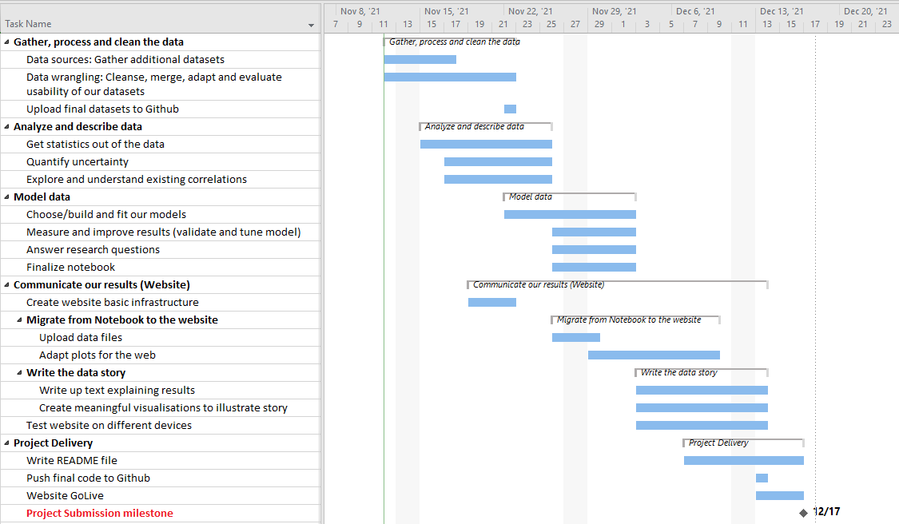

# Trump vs Clinton: the 2016 Presidential election through their own words

## Abstract

"I've just received a call from Secretary Clinton," said Donald Trump late in the night of Nov 8, 2016. The result of the 58th Presidential election, an intense battle between Donald Trump and Hillary Clinton, remains a major upset around the world. But was it? What can be seen and understood from this election, using only quotes by these candidates in the media? This could give a glimpse into the running of a major democratic election system, and the importance that speech and its representations have in making citizens turn for one party or another. Media biases have deep implications in our lives, and have evolved to be more extreme in this noisy world. We will analyze how Trump and Clinton's words quoted in media outlets relate to the polarization seen during the 2016 U.S. election.

## Research questions

### _Media bias_: Do media outlets portray Trump and Clinton differently?

1. **Coverage**: Did the outlets report different quotes at a given point in time? For a given outlet, was the average valence of reported quotes the same for the two candidates?
2. **Bias**: Does the bias of the news outlets correlate with our previous findings?

### _Political issues_: Did Clinton and Trump address political issues differently?

1. **Topics**: Did they address the same topics?
2. **Trendsetter**: Did they address the topics at the same time? If not, who discussed it first?
3. **Trend follower**: Did they address issues when they were being discussed in general?

### _Language_: How does the quoted language of Clinton and Trump differ?

1. **Intellectuality**: Did they express different levels of intellectuality (more complicated words; more colloquial words)?
2. **Sentiment**: Did they address certain topics or people more positively or negatively?
3. **Pronouns**: How do the candidates use pronouns and what pronouns do they prefer?

### Further Ideas

- Which other speakers mention the candidates, and what do they say about them?

## Additional datasets

### Media bias

- It would be interesting to find a dataset ranking news outlets by popularity. So far the closest we've come to finding one is [here](https://www.similarweb.com/fr/top-websites/united-states/category/news-and-media/)
- It would help to find a dataset to match a URL to the news outlet name
- Media bias data ([AllSides](https://www.kaggle.com/supratimhaldar/allsides-ratings-of-bias-in-electronic-media))

### Political topics

It would be interesting to use data which helps us understand what happens outside of the universe of Trump and Clinton quotes so that we can put the data in context.

- **Scraping Newspapers for political topics (CNN, Breitbart, Fox, etc)**
  - Paywalls could be a problem but the article titles are usually open and include the topic. Otherwise we can use [Wayback Machine](https://archive.org/).
  - Services such as Cloudflare could cause problems.
- **Dataset of political topics of importance to citizens of the US.**
  - Polling services such as Gallup, YouGov, Statista, Pew, etc. have plenty of historic data.
- **Datasets for common English words**
  - English [adjectives](https://gist.github.com/hugsy/8910dc78d208e40de42deb29e62df913)
  - English [verbs](https://www.wordexample.com/list/most-common-verbs-english/)
  - NLTK stopwords

### Language

#### Intellectuality

- [The EnglishProfile website](https://www.englishprofile.org/american-english) assigns each word in American English to a CEFR level (A1 to C2), so we scraped it with [BeautifulSoup](https://beautiful-soup-4.readthedocs.io/en/latest/) for the data we need; the cleaning is detailed in the notebook.

## Methods

### Media bias

- Compute the positivity score of quotes (using the NLTK library), and use this to observe whether for a given outlet, quotes from one candidate are more positive than the other.
- Using the AllSides data, look at whether the difference in positivity score correlates with the bias of the outlet.
- Consider for each quote, the average bias of the outlets which reported it.

### Political issues

In identifying political topics we will go with a hybrid approach:

- **Extract quotes covering the most prominent topics (e.g. gun control, Obamacare, abortion...)**
  - Obtain a list of topics (see for example [Pew 2016](https://www.pewresearch.org/politics/2016/07/07/4-top-voting-issues-in-2016-election/)) and use regular expressions to extract relevant quotes.
- **Find less obvious topics or subtopics (e.g. scandals or shootings with short-lived media attention)**
  - We can remove classes of words (stopwords, adjectives, verbs) and iteratively check the most frequent word after the filtering
  - Use a more automatic method such as LDA, e.g. with [scikit-learn](https://scikit-learn.org/stable/modules/generated/sklearn.decomposition.LatentDirichletAllocation.html).

### Language

#### Intellectuality

- Measure intellectuality of words by the number of syllables. For this, the [CMU Pronouncing Dictionary](http://www.speech.cs.cmu.edu/cgi-bin/cmudict) allows us to divide words into phonemes and the [syllables package](https://pypi.org/project/syllables/) uses heuristics which is a bit less precise but much faster.
- Evaluate the average English level of a speaker in terms of the CEFR level associated with each word they use, using the CEFR level dataset.
- Evaluate words based on their commonality in the English language.
- It might also be interesting to count the number of unique words across the whole quotes uttered.
- Find an appropriate dataset, we could try to measure the proportion of formal versus colloquial words.

#### Sentiment

The idea here is to categorize the quotes as "negative", "neutral" or "positive".

- Use existing libraries such as [NLTK Pre-Trained Sentiment Analyzer](https://www.nltk.org/api/nltk.sentiment.html), as they usually are very efficient and will allow us to focus on the data analysis rather than the technical implementation of the algorithms.
- Another approach is to use a pre-trained BERT NLP model to transform our quotations into high-dimensional token embedding vectors, on which we can then apply PCA and plot the two axes. This can be obtained through the [transformers](https://huggingface.co/transformers/) library.

- Perform sentiment analysis on the target of quotes using NLTK. For instance, Trump calling Clinton "Crooked Hillary" would be a negative statement about Presidential candidate Clinton.

#### Pronouns

- Use regular expressions to get the number of times that "I", "we", "they", "them" were uttered.

## Timeline
Tentative schedule subject to change, as the data science workflow is a non-linear, iterative process.

## Organization

- **Auguste**: Language intellectuality, media bias analysis, organisation of codebase.
- **Francis**: Project management, sentiment analysis, data visualisation and web integration.
- **Dean**: Website setup, political topics analysis and data visualisation.
- **Leonard**: Sentiment analysis, NLP.

## Questions for TAs

- Do we have enough research questions?
- How scientific do we have to be in motivating our decisions? Example: Choosing a cutoff probability for which we discard quotes because we deem the prediction to be too bad.
